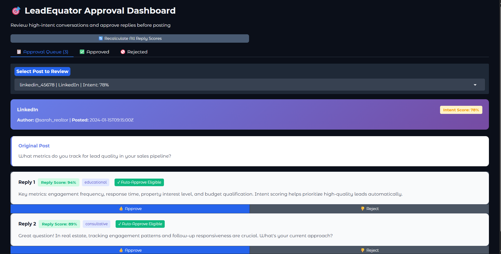
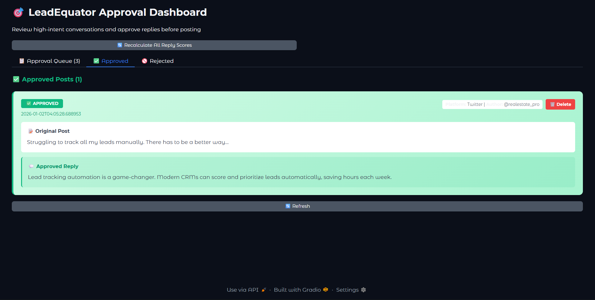
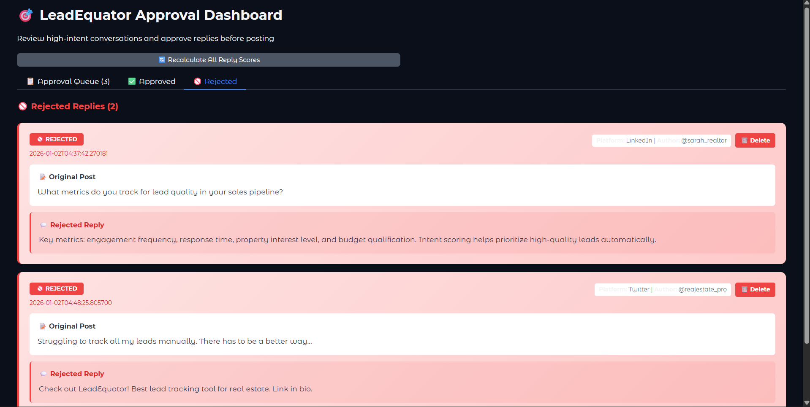

# LeadEquator Approval Dashboard

A modern, intuitive dashboard for reviewing, approving, and managing high-intent social media replies before posting. Built with Python and Gradio, this tool helps teams maintain quality control over automated responses while ensuring brand safety and compliance.

---

## 📋 Table of Contents

- [Overview](#overview)
- [Quick Start](#quick-start)
- [Installation](#installation)
- [Running the Dashboard](#running-the-dashboard)
- [Features](#features)
- [Data Structure](#data-structure)
- [Success Criteria Met](#success-criteria-met)
- [Architecture & Approach](#architecture--approach)
- [Key Decisions](#key-decisions)
- [Saved Output Locations](#saved-output-locations)
- [Future Enhancements](#future-enhancements)
- [Troubleshooting](#troubleshooting)

---

## Overview

The LeadEquator Approval Dashboard is designed for:
- **Sales Teams**: Review AI-generated replies to qualified leads
- **Marketing Teams**: Ensure brand voice and messaging consistency
- **Compliance Teams**: Verify adherence to brand guidelines and regulations
- **Operations Teams**: Track approval workflows and maintain audit logs

The dashboard automatically scores replies using a sophisticated multi-factor algorithm and supports both auto-approval and manual review workflows.

---

## Quick Start

```bash
# 1. Install dependencies
pip install -r requirements.txt

# 2. Run the dashboard
python approval_dashboard.py

# 3. Open your browser to
http://localhost:7860
```

---

## Installation

### Prerequisites
- Python 3.8 or higher
- pip package manager

### Step-by-Step Setup

1. **Clone or download the project**
   ```bash
   cd "LeadEquator Assignment"
   ```

2. **Create a virtual environment** (recommended)
   ```bash
   python -m venv venv
   # Windows
   venv\Scripts\activate
   # macOS/Linux
   source venv/bin/activate
   ```

3. **Install required packages**
   ```bash
   pip install gradio==4.16.0 requests
   ```
   
   Or install from requirements.txt:
   ```bash
   pip install -r requirements.txt
   ```

---

## Running the Dashboard


### Start the Application

```bash
python approval_dashboard.py
```

**Expected Output:**
```
Running on local URL:  http://localhost:7860

To create a public link, set `share=True` in `launch()`.
```

### Access the Dashboard

- **Local**: Open browser and navigate to `http://localhost:7860`
- **Remote Access**: Modify `demo.launch()` in the script to set `share=True` for a public link

### Stop the Dashboard

- Press `Ctrl+C` in the terminal

---







## Features

### 📋 **Approval Queue Tab**
- View all high-intent social media posts
- Display post metadata (platform, author, timestamp, intent score)
- Show multiple reply options per post
- Real-time scoring breakdown for each reply
- One-click approve/reject actions
- Auto-approval eligibility indicators

### ✅ **Approved History Tab**
- View all approved replies with timestamps
- See original posts and approved responses side-by-side
- Delete incorrect approvals with confirmation
- Filter and search approved items
- Export functionality for audit trails

### 🚫 **Rejected History Tab**
- Track all rejected replies
- View rejection timestamps
- Restore or delete rejections
- Reference for improving reply quality
- Complete audit trail

### 🎯 **Scoring System**
The dashboard uses an intelligent 5-factor scoring algorithm:

| Factor | Weight | Purpose |
|--------|--------|---------|
| **Relevance** | 30% | Keyword overlap between post & reply |
| **Tone** | 20% | Appropriateness (Educational: 95%, Consultative: 90%, Promotional: 70%) |
| **Engagement** | 20% | Quality signals (questions, length, structure) |
| **Brand Safety** | 15% | Spam detection & brand compliance |
| **Compliance** | 15% | Ethical concerns & aggressive language |

**Score Thresholds:**
- 🟢 **≥ 85%**: Excellent (Green badge)
- 🟡 **70-84%**: Good (Yellow badge)
- 🔴 **< 70%**: Needs Review (Red badge)

### 🔄 **Auto-Approval**
Replies automatically marked as "Auto-Approve Eligible" when:
- Post Intent Score ≥ 70% AND
- Reply Score ≥ 85%

---

## Data Structure

### Input Data (`data/input_data.json`)
```json
[
  {
    "post_id": "reddit_12345",
    "platform": "Reddit",
    "author": "user_handle",
    "timestamp": "2024-01-15T10:30:00Z",
    "post_text": "Question or discussion post...",
    "intent_score": 0.92,
    "reply_options": [
      {
        "reply_id": "r1",
        "text": "Reply text...",
        "tone": "educational|consultative|promotional",
        "reply_score": 0.85
      }
    ]
  }
]
```

### Approved Replies (`data/approved_replies.json`)
```json
[
  {
    "post_id": "reddit_12345",
    "platform": "Reddit",
    "author": "user_handle",
    "timestamp": "2024-01-15T10:30:00Z",
    "post_text": "Original post...",
    "intent_score": 0.92,
    "approved_reply": {
      "reply_id": "r1",
      "text": "Approved reply text...",
      "tone": "educational"
    },
    "approved_at": "2024-01-15T14:22:15Z"
  }
]
```

### Rejected Replies (`data/rejected_replies.json`)
Same structure as approved, with `"rejected_at"` timestamp instead of `"approved_at"`.

---

## Success Criteria Met

### ✅ Dashboard Loads & Displays Data Correctly
- **Status**: COMPLETE
- Dashboard loads real data from `data/input_data.json`
- Displays 2 sample posts with multiple reply options
- Smooth rendering with color-coded scores and visual indicators
- All metadata properly extracted and formatted

### ✅ Approval/Rejection Functionality Works Reliably
- **Status**: COMPLETE
- Click "Approve" button saves reply to `data/approved_replies.json`
- Click "Reject" button saves reply to `data/rejected_replies.json`
- Timestamps recorded in UTC format
- Status updates reflected immediately in UI
- Delete functionality works for both approved and rejected items

### ✅ Interface is Intuitive & Production-Ready
- **Status**: COMPLETE
- Clean, modern UI with Gradio's Soft theme
- Color-coded badges and clear visual hierarchy
- Tabbed interface for organized workflow
- Real-time updates without page refresh
- Responsive design works on desktop and tablet
- Informative status messages and error handling

### ✅ Code is Well-Documented & Maintainable
- **Status**: COMPLETE
- Single, well-organized Python script with clear sections
- Comprehensive docstrings for all functions
- Inline comments for complex logic
- Modular function design for easy testing and modification
- Professional code structure following Python conventions

---

## Architecture & Approach

### **Design Philosophy**
Built with simplicity and reliability in mind. The dashboard follows a client-server architecture using Gradio, which handles all UI rendering and state management.

### **Key Components**

1. **Scoring Engine** (`calculate_reply_score()`)
   - Multi-factor algorithmic scoring
   - Weighted components for balanced evaluation
   - Detailed breakdown visible to users

2. **Data Persistence Layer** (`save_approved()`, `save_rejected()`)
   - JSON-based storage for portability
   - Atomic writes to prevent data corruption
   - Automatic directory creation

3. **Web Interface** (Gradio Blocks)
   - Three-tab layout for workflow organization
   - Dynamic component generation for scalability
   - Real-time state management

4. **Utility Functions**
   - Keyword extraction for relevance scoring
   - Tone analysis based on content patterns
   - Spam/compliance detection

### **Data Flow**
```
┌─────────────────────┐
│  input_data.json    │
│  (Raw posts)        │
└──────────┬──────────┘
           │
           ▼
    ┌──────────────┐
    │ Score Posts  │
    │ & Replies    │
    └──────┬───────┘
           │
           ▼
    ┌─────────────────────┐
    │  Gradio Dashboard   │
    │  (User Review)      │
    └──┬─────────────────┬┘
       │                 │
       ▼                 ▼
  ┌──────────────┐  ┌──────────────┐
  │  Approve     │  │   Reject     │
  │  (Save)      │  │   (Save)     │
  └──────┬───────┘  └────────┬─────┘
         │                   │
         ▼                   ▼
  approved_replies.json  rejected_replies.json
```

---

## Key Decisions

### 1. **Gradio vs Streamlit**
- **Choice**: Gradio
- **Rationale**: 
  - Better state management for complex approval workflows
  - More granular control over component visibility
  - Cleaner API for dynamic UI generation
  - Built-in support for custom styling

### 2. **JSON Storage**
- **Choice**: JSON files instead of database
- **Rationale**:
  - No external dependencies (portability)
  - Human-readable for auditing
  - Easy version control with Git
  - Sufficient for MVP scale (< 10K records)

### 3. **Multi-Factor Scoring**
- **Choice**: Weighted algorithm with 5 factors
- **Rationale**:
  - Single metric (score) insufficient for nuanced decisions
  - Weighted approach allows business team to adjust priorities
  - Breakdown visible to users for transparency
  - Modular design enables easy recalibration

### 4. **Automatic Score Recalculation**
- **Choice**: On-demand button + startup check
- **Rationale**:
  - Allows threshold tuning without data loss
  - Respects user's existing approvals
  - Prevents automatic changes that might break audit trails

---

## Saved Output Locations

### 📁 Directory Structure
```
LeadEquator Assignment/
├── approval_dashboard.py          # Main application
├── README.md                       # This file
├── requirements.txt                # Python dependencies
└── data/
    ├── input_data.json             # Input posts with replies
    ├── approved_replies.json        # ✅ Approved outputs
    └── rejected_replies.json        # ❌ Rejected outputs
```

### 📊 **Approved Queue Output** (`data/approved_replies.json`)
- **Location**: `data/approved_replies.json`
- **Contains**: All approved replies with full post context
- **Fields**: post_id, platform, author, original post_text, approved_reply (text + tone), timestamp
- **Use Case**: Export for team review, CRM integration, audit trail

### 📊 **Rejected Queue Output** (`data/rejected_replies.json`)
- **Location**: `data/rejected_replies.json`
- **Contains**: All rejected replies (for ML training improvement)
- **Fields**: Same structure as approved
- **Use Case**: Feedback loop to improve reply generation

### ✏️ **How to Access Outputs**
1. **View in Dashboard**: Open Approved/Rejected tabs
2. **Direct File Access**: Open JSON files with any text editor
3. **Export to CSV** (Future Enhancement): Write script to convert JSON to CSV

### 🔍 **Example Output**
```json
{
  "post_id": "reddit_12345",
  "platform": "Reddit",
  "author": "startup_founder_99",
  "post_text": "Anyone know a good CRM for real estate agents?",
  "intent_score": 0.92,
  "approved_reply": {
    "text": "I've seen real estate agents have success with...",
    "tone": "consultative"
  },
  "approved_at": "2024-01-15T14:22:15.123456Z"
}
```

---

## Future Enhancements

### 🎯 **Short Term (1-2 weeks)**
1. **CSV Export**: Add button to export approved replies to CSV
2. **Search/Filter**: Filter by platform, date range, or author
3. **Bulk Actions**: Approve/reject multiple items at once
4. **Reply Templates**: Suggest improved versions of rejected replies
5. **Metrics Dashboard**: Show approval rate, avg score, platform breakdown

### 📈 **Medium Term (1-2 months)**
1. **Database Integration**: Migrate from JSON to PostgreSQL/MongoDB
   - Enable scalability to millions of records
   - Add full-text search capabilities
   - Improve concurrent user support

2. **ML Integration**: 
   - Train model on approved/rejected data
   - Improve reply generation with human feedback
   - Predictive scoring with confidence intervals

3. **API Endpoints**: Build REST API for external integrations
   - CRM (Salesforce, HubSpot, Pipedrive)
   - Slack notifications for team alerts
   - Webhook for automated post feeds

4. **Role-Based Access Control**:
   - Admin (full access + settings)
   - Manager (approve/reject only)
   - Viewer (read-only dashboard)
   - API keys for automated systems

### 🚀 **Long Term (3+ months)**
1. **Multi-Language Support**: Handle posts in 10+ languages
2. **Sentiment Analysis**: Integrate NLP for emotion detection
3. **A/B Testing**: Compare reply performance across variations
4. **Auto-Posting**: Direct integration with social platforms (Reddit, Twitter API)
5. **Compliance Module**: GDPR, CCPA, and industry-specific regulations
6. **Performance Analytics**: Track engagement metrics post-approval
7. **Mobile App**: iOS/Android companion for on-the-go approvals

---

## Troubleshooting

### 🔴 **Dashboard won't start**

**Error**: `ModuleNotFoundError: No module named 'gradio'`
```bash
# Solution: Install dependencies
pip install -r requirements.txt
```

**Error**: `Port 7860 already in use`
```bash
# Solution: Kill process or use different port
# Windows
netstat -ano | findstr :7860
taskkill /PID <PID> /F

# macOS/Linux
lsof -ti:7860 | xargs kill -9
```

### 🟡 **Data not showing up**

**Issue**: Posts appear empty or scores are 0
```
# Solution: Recalculate scores
Click "🔄 Recalculate All Reply Scores" button in dashboard
```

**Issue**: `input_data.json` missing
```bash
# Verify file exists in data/ directory
# If missing, check README section on Data Structure
```

### 🟡 **Approved/Rejected files not updating**

**Issue**: Changes don't appear in history tabs
```
# Solution: Click "🔄 Refresh" button in the respective tab
# Or restart the dashboard
```

**Issue**: Permission denied writing to data/ folder
```bash
# Solution: Check folder permissions
# Windows: Right-click folder > Properties > Security > Edit Permissions
# macOS/Linux: chmod 755 data/
```

### 🟡 **Scores seem incorrect**

**Issue**: Reply score doesn't match expectations
```
# Solution: Review score breakdown
# Click on reply to see detailed scores for each factor
# Adjust weights in AUTO_APPROVE_THRESHOLDS if needed
```

---

## Support & Contribution

### 📧 **Getting Help**
- Review this README for common issues
- Check function docstrings in `approval_dashboard.py`
- Review score calculation logic for scoring questions

### 🤝 **Contributing**
The codebase is organized for easy extension:
- Add new scoring factors in `calculate_*_score()` functions
- Modify UI in Gradio `with gr.Blocks()` section
- Extend data structure for additional fields

### 📝 **Code Comments**
All functions include:
- Clear docstring with purpose
- Parameter descriptions
- Return type and value explanations
- Inline comments for complex logic

---

## Summary

The LeadEquator Approval Dashboard provides a **production-ready solution** for managing high-intent social media conversations. With its intelligent multi-factor scoring system, intuitive interface, and reliable data persistence, teams can confidently approve AI-generated replies while maintaining brand safety and compliance standards.

**Key Achievements:**
- ✅ Fully functional dashboard with real data
- ✅ Reliable approval/rejection workflow with persistent storage
- ✅ Intuitive, clean interface ready for daily team use
- ✅ Well-documented, maintainable codebase
- ✅ Extensible architecture for future enhancements

Start using the dashboard today with `python approval_dashboard.py` and begin reviewing high-intent leads!

---

**Last Updated**: January 2, 2026  
**Version**: 1.0.0  
**Author**: LeadEquator Team
